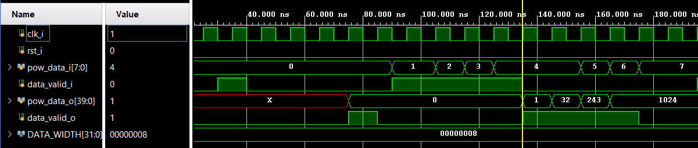

# Лабораторная работа 5. Конвейеры и систолические массивы

## Цель работы

Изучить принципы конвейеризации цифровых схем и основы построения систолических массивов.

В рамках лабораторной работы необходимо:
- сравнить комбинаторную и конвейеризованную реализацию вычислений;
- изучить влияние конвейеризации на критический путь и тактовую частоту;
- добавить `clock gating` для регистров с данными;
- убрать лишние сбросы в конвейере;
- модифицировать систолический массив и проверить его работу в моделировании.

## Краткая теория

### Конвейеризация

Конвейер в цифровой технике позволяет разбить длинную цепочку комбинаторной логики на несколько стадий, разделённых регистрами.  
Это уменьшает критический путь и позволяет увеличить максимальную тактовую частоту схемы.

При этом важно учитывать, что конвейеризация:
- повышает пропускную способность;
- увеличивает латентность;
- требует корректной передачи промежуточных данных между стадиями.

### Критический путь

Критический путь — это наиболее длинная цепочка комбинаторной логики в схеме, которая ограничивает максимальную рабочую частоту.

Уменьшение длины критического пути позволяет повысить `Fmax` и улучшить производительность схемы.

### Clock gating и сигнал `valid`

Для снижения динамического энергопотребления в конвейере можно использовать `clock gating`.  
На практике в RTL это обычно реализуется через условную запись в регистры по сигналу `enable`.

Добавление сигнала `valid` позволяет:
- передавать вместе с данными признак их корректности;
- не переключать регистры с данными в те такты, когда полезных данных нет;
- снизить лишнюю активность логики.

### Систолические массивы

Систолический массив — это регулярная структура из однотипных вычислительных узлов, где данные и промежуточные результаты распространяются между соседними ячейками.

Такие массивы используются в задачах:
- матричных вычислений;
- цифровой обработки сигналов;
- ускорения нейросетевых алгоритмов.

## Что было сделано в работе

В ходе лабораторной работы были рассмотрены примеры комбинаторной и конвейеризованной реализации вычислений, а также изучено влияние конвейеризации на тактовую частоту схемы.

Далее в исходный код конвейера были внесены изменения:
- добавлен `clock gating` для регистров с данными;
- удалены лишние сигналы сброса в регистрах конвейера;
- написан testbench и выполнена проверка корректности работы после изменений.

Также был модифицирован пример систолического массива:
- исходный массив размера `2x2` был расширен до массива `2x3`;
- добавлены два новых узла;
- написан testbench для проверки правильности распространения данных и частичных сумм.

## Выполненные задания

### 1. Сравнение конвейеризованной и неконвейеризованной реализации

Был проведён сравнительный анализ тактовой частоты для примера без конвейеризации и для конвейеризованного варианта.

Конвейеризованная реализация работает быстрее, поскольку:
- критический путь разбит регистрами на более короткие участки;
- каждая стадия содержит меньше комбинаторной логики;
- уменьшается задержка распространения сигнала за один такт.

### 2. Добавление `clock gating`

В конвейер был добавлен `clock gating` для регистров, хранящих данные.

Это позволило:
- исключить лишние переключения регистров при отсутствии валидных данных;
- снизить динамическое энергопотребление;
- сохранить корректность работы конвейера.

Корректность работы после внесённых изменений была проверена в testbench.

#### Временная диаграмма

Ниже показана временная диаграмма:

### 3. Удаление лишних сбросов

Из регистров конвейера были убраны лишние сбросы, не влияющие на корректность обработки данных при наличии сигнала `valid`.

Такой подход позволяет:
- упростить логику;
- уменьшить избыточность описания;
- приблизить стиль проектирования к более эффективному RTL-подходу.

После удаления лишних сбросов работа схемы также была проверена в моделировании.

### 4. Модификация систолического массива

Исходный систолический массив размером `2x2` был расширен до массива `2x3`.

Для этого:
- были добавлены ещё два узла;
- сохранён принцип распространения входных данных сверху вниз;
- сохранён принцип распространения частичных сумм слева направо.

Работа обновлённого массива была проверена с помощью testbench.

## Что проверялось в testbench

В testbench проверялись:
- корректная работа конвейера после добавления `clock gating`;
- корректная работа конвейера после удаления лишних сбросов;
- передача сигнала `valid` по стадиям конвейера;
- корректность вычислений в конвейеризованном модуле;
- корректность работы систолического массива `2x3`;
- правильное распространение входных данных и частичных сумм между узлами массива.

## Результат работы

В результате выполнения лабораторной работы были получены навыки:
- анализа критического пути цифровой схемы;
- понимания преимуществ конвейеризации;
- использования сигнала `valid` в конвейерных структурах;
- добавления `clock gating` для уменьшения лишней активности регистров;
- проектирования и модификации систолических массивов;
- написания testbench для проверки конвейерных и регулярных вычислительных структур.

## Вывод

В ходе лабораторной работы были изучены основы конвейеризации цифровых схем, влияние критического пути на тактовую частоту и способы повышения эффективности работы конвейера.  
Практически были выполнены модификации конвейера с добавлением `clock gating` и удалением лишних сбросов, а также расширен систолический массив с `2x2` до `2x3`.  
Корректность работы реализованных решений была подтверждена в моделировании.

### Файлы

- [pow5_pipelined_valid.sv](./rtl/pow5_pipelined_valid.sv)
- [syst_node.sv](./rtl/syst_node.sv)
- [syst_ws.sv](./rtl/syst_ws.sv)
- [tb_pow5_pipelined_valid.sv](./tb/tb_pow5_pipelined_valid.sv)
- [tb_syst_ws.sv](./tb/tb_syst_ws.sv)