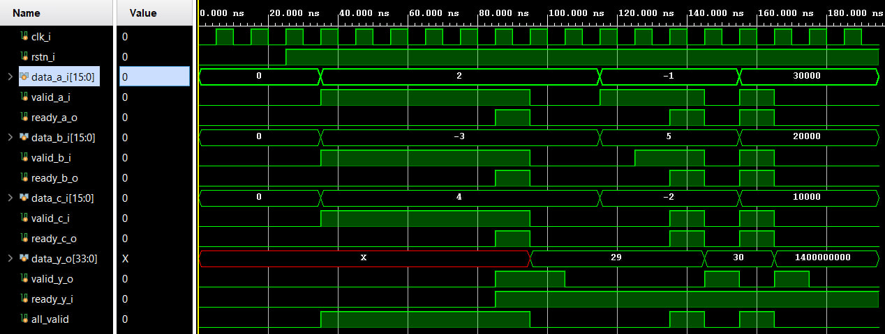

# Лабораторная работа 6. AXI-Stream, Valid-Ready, Credit Flow Control

## Цель работы

Изучить принципы потоковой передачи данных с использованием интерфейсов `valid-ready` и `AXI-Stream`, а также реализовать:
- вычислительный модуль с интерфейсом `valid-ready`;
- потоковый вычислительный конвейер с FIFO;
- AXI-Stream-коммутатор со статической маршрутизацией и арбитражом.

## Задание 1

В файле `task1.sv` реализован модуль `task1`, который принимает три входных значения `a`, `b`, `c` и вычисляет выражение:

```text
y = a² + b² + c²
```

### Особенности реализации

- используются три входных канала: `data_a_i`, `data_b_i`, `data_c_i`;
- у каждого входа есть свои сигналы `valid` и `ready`;
- вычисление выполняется только тогда, когда данные одновременно готовы на всех трёх входах;
- результат сохраняется во внутреннем регистре и передаётся через выходной интерфейс `valid-ready`;
- ширина выходных данных — `34` бита (`data_y_o[33:0]`).

### Тестирование

В файле `tb_task1.sv` реализован простой testbench, который проверяет:
- подачу нескольких наборов входных данных;
- работу с положительными и отрицательными числами;
- корректную выдачу результата только при наличии всех валидных входов;
- зависимость передачи результата от сигнала `ready_y_i`.

### Временная диаграмма

Ниже показана временная диаграмма для задания 1:



По диаграмме видно, что:
- выходной результат появляется только при `all_valid = 1`;
- передача результата зависит от `ready_y_i`;
- для примеров на диаграмме получаются значения `29`, `30` и `1400000000`.

## Задание 2

В файле `task2.sv` реализован потоковый вычислительный конвейер. Обработка входного потока выполняется по этапам:

```text
1) x - 2
2) + значение 3 транзакции назад
3) * 9
4) + 76
5) % 1024
```

### Особенности реализации

- входной интерфейс: `s_valid_i`, `s_ready_o`, `s_data_i`;
- выходной интерфейс: `m_valid_o`, `m_ready_i`, `m_data_o`;
- модуль работает как последовательный конвейер обработки потока;
- используется история значений для операции со сдвигом на 3 транзакции назад;
- в тракте используются FIFO-модули;
- ширина выходных данных — `11` бит.

### Дополнительные модули

Для задания 2 используются:
- `fifo_wrapper.sv` — обёртка FIFO с интерфейсом `valid-ready`;
- `simple_fifo.sv` — простая реализация FIFO.

### Тестирование

В файле `tb_task2.sv` реализован testbench, в котором проверяются:
- последовательная подача нескольких входных значений;
- работа конвейера при активном и неактивном `m_ready_i`;
- поведение схемы при backpressure;
- выдача результатов после паузы на выходе.

## Задание 3

Для задания 3 реализован AXI-Stream-коммутатор `4x6`, собранный из нескольких модулей.

### Используемые файлы

- `axis_fork_1to6.sv` — направляет один входной поток на один из шести выходов по значению `TDEST`;
- `axis_join_static_4to1.sv` — объединяет четыре входных потока в один выход со статическим приоритетом;
- `axis_switch_static_4x6.sv` — верхний модуль коммутатора `4x6`;
- `tb_axis_switch_static_4x6.sv` — testbench для проверки коммутатора.

### Особенности реализации

- количество входов — `4`;
- количество выходов — `6`;
- маршрутизация выполняется по `TDEST`;
- выбор активного входа выполняется статическим арбитражом;
- вход с меньшим номером имеет более высокий приоритет;
- номер выбранного входа передаётся через поле `TUSER`.

### Тестирование

В testbench проверяются:
- передача данных на нужный выход;
- работа маршрутизации по `TDEST`;
- конфликт нескольких входов на один выход;
- корректность статического приоритета.

## Структура файлов

### Файлы

- [task1.sv](./task1/rtl/task1.sv) — модуль задания 1, вычисление `a² + b² + c²`
- [tb_task1.sv](./task1/tb/tb_task1.sv) — testbench для задания 1
- [task2.sv](./task2/rtl/task2.sv) — модуль задания 2, потоковый вычислительный конвейер
- [tb_task2.sv](./task2/tb/tb_task2.sv) — testbench для задания 2
- [fifo_wrapper.sv](./task2/rtl/fifo_wrapper.sv) — FIFO-обёртка
- [simple_fifo.sv](./task2/rtl/simple_fifo.sv) — реализация простой FIFO
- [axis_fork_1to6.sv](./task3/rtl/axis_fork_1to6.sv) — fork-модуль AXI-Stream `1 -> 6`
- [axis_join_static_4to1.sv](./task3/rtl/axis_join_static_4to1.sv) — join-модуль AXI-Stream `4 -> 1`
- [axis_switch_static_4x6.sv](./task3/rtl/axis_switch_static_4x6.sv) — верхний модуль коммутатора `4x6`
- [tb_axis_switch_static_4x6.sv](./task3/tb/tb_axis_switch_static_4x6.sv) — testbench для коммутатора
- [waveform_task_1.png](./materials/waveform_task_1.png) — временная диаграмма для задания 1
- [Otvets.md](./materials/Otvets.md) - ответы на контрольные вопросы

## Вывод

В ходе лабораторной работы были реализованы три варианта потоковой обработки данных:
- вычислительный модуль с интерфейсом `valid-ready`;
- конвейер с FIFO и управлением передачей данных через `valid/ready`;
- AXI-Stream-коммутатор с маршрутизацией и статическим арбитражом.

Работа позволила на практике разобраться с handshake-механизмом, backpressure, буферизацией через FIFO и базовыми принципами коммутации AXI-Stream-потоков.
