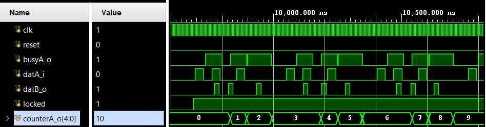

# Лабораторная работа 7. Синхронизация между доменами тактовых частот (CDC)

## Цель работы

Изучить методы синхронизации сигналов между различными доменами тактовых частот (`Clock Domain Crossing`, CDC), а также реализовать:
- toggle synchronizer;
- busy handshake;
- передачу многобитных данных через Gray code;
- генерацию нескольких clock domain через Clock Wizard.


## Описание проекта

В проекте реализована передача события между двумя независимыми тактовыми доменами:
- `clkA_i`
- `clkB_i`

Для передачи используется toggle-based synchronizer с обратным сигналом занятости (`busy`).

Также реализована передача значения счётчика между доменами через код Грея.


## Особенности реализации

### Toggle synchronizer

Событие в домене `clkA_i` преобразуется в toggle-сигнал:

```systemverilog
toggleA <= toggleA ^ datA_i;
```

После этого сигнал синхронизируется в домене `clkB_i`.


## Busy handshake

Для контроля передачи используется сигнал:

```systemverilog
busyA_o
```

Передача считается завершённой после обратной синхронизации toggle-сигнала.


## Gray code

Счётчик событий формируется в домене `clkB_i`:

```systemverilog
counterB <= counterB + 1;
```

Для безопасной передачи между clock domain используется код Грея:

```systemverilog
assign grey_o = (counterB >> 1) ^ counterB;
```

После синхронизации значение преобразуется обратно в бинарный код.

## Clock Wizard

Для генерации тактовых сигналов используется `clk_wiz_0`.

### Частоты сигналов

| Сигнал | Частота |
|---|---|
| `clkA_i` | ≈ 31 MHz |
| `clkB_i` | ≈ 54 MHz |

Также используется сигнал `locked` для корректного запуска логики после стабилизации MMCM.


## Тестирование

В testbench проверяются:

- передача события между clock domain;
- работа synchronizer;
- корректное формирование `busyA_o`;
- генерация импульса `datB_o`;
- работа счётчика;
- передача данных через Gray code;
- работа `reset` и `locked`.

### Временная диаграмма



## Структура файлов

### Файлы

- [top_synchroniser.sv](./rtl/top_synchroniser.sv) — верхний модуль
- [synchroniser_flag_busy.sv](./rtl/synchroniser_flag_busy.sv) — CDC synchronizer
- [tb_top_synchroniser.sv](./tb/synchroniser_tb.sv) — testbench
- [cdc_waveform.png](./materials/cdc_waveform.png) — временная диаграмма


## Вывод

В ходе лабораторной работы были изучены основные методы Clock Domain Crossing и реализованы:

- toggle synchronizer;
- busy handshake;
- multi-flop synchronizer;
- передача данных через Gray code.

Работа позволила изучить проблемы metastability и методы безопасной передачи сигналов между различными тактовыми доменами FPGA.